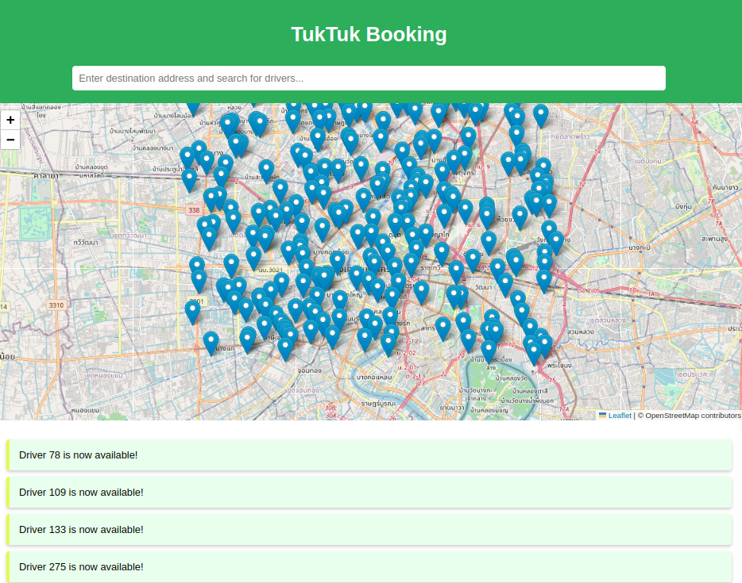

# TukTuk Booking Application

A real-time web application for booking TukTuk drivers in Bangkok. The application uses **NestJS** for the backend, **Socket.IO** for real-time updates, and **Leaflet.js** for interactive maps.



---

## Features

- **Real-time Driver Updates**: See all available TukTuk drivers on a live map.
- **Booking System**: Book a driver and specify your destination.
- **Driver Registration**: New drivers can register themselves or be added through a simulation script.
- **Notifications**: Drivers and users receive instant notifications about bookings.
- **Random Driver Simulation**: Drivers are dynamically added with random locations in Bangkok.

---

## Installation

### Backend

1. Navigate to the backend directory:
   ```bash
   cd backend
